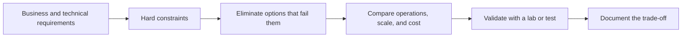

# Google Cloud | Hands-On Lab Portfolio

**Professional Cloud Architect certified · Cloud networking, applications, data, and security**

I use this repository to document the Google Cloud services I practiced in guided labs and the architecture decisions I learned to make. My focus is connecting technical choices to requirements: secure connectivity, reliable deployments, appropriate data stores, and manageable operations.

[Explore 22 verified lab completions](LABS.md#verified-completions) · [Read architecture decision notes](ARCHITECTURE_NOTES.md)

> **Portfolio scope:** My Google Skills history shows 47 attempts across 34 distinct labs. Google Skills marks 22 distinct labs as **Passed**; each has its own page and a screenshot of the activity record. The other 12 are listed separately as practice attempts. These are guided labs, not 34 independent projects or 22 earned Skill Badges. The Professional Cloud Architect certification is separate from the labs.

## What I practiced

| Track | Services and tasks | What I can discuss |
| --- | --- | --- |
| **Network foundations** | VPCs, firewalls, peering, Private Google Access, Cloud NAT, load balancers, Cloud DNS | How traffic enters, moves between networks, reaches Google APIs, and exits privately |
| **Compute and delivery** | Compute Engine, persistent disks, MIG autoscaling, Cloud Run, GKE, Autopilot | Choosing a runtime and scaling layer based on workload and operational needs |
| **Data platforms** | Cloud Storage, Cloud SQL, Firestore, Spanner, Bigtable, BigQuery | Matching transactional, analytical, document, and wide-column needs to the right service |
| **Security and operations** | IAM, service accounts, Secret Manager, Cloud KMS, Bucket Lock, Log Analytics | Least privilege, secret and key boundaries, retention, and investigating events |

## Architecture thinking in practice

The [architecture notes](ARCHITECTURE_NOTES.md) show examples of this reasoning for private networking, container runtimes, data stores, and security controls. They are learning notes, not claims of production deployment.

## Evidence and next steps

- **Verified now:** [22 individual lab pages](LABS.md#verified-completions), each with a Google Skills progress screenshot showing the Passed marker, recorded score, and date.
- **Also documented:** [12 additional practice labs](LABS.md#additional-practice-attempts) that Google Skills does not mark as passed, plus original [architecture notes](ARCHITECTURE_NOTES.md).
- **Not claimed:** original deployment code, live lab environments, independently reproducible projects, or Skill Badges for these activities.
- **Next portfolio milestone:** build two original, reproducible mini-projects with source code, architecture diagrams, deployment and cleanup steps, tests, and cost boundaries.

No exam dumps, paid course questions, third-party lab instructions, credentials, or cloud project identifiers are included in this repository.
