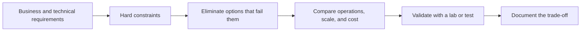

# Google Cloud | Hands-On Lab Portfolio

**Professional Cloud Architect certified · Cloud networking, applications, data, and security**

I use this repository to document the Google Cloud services I practiced in guided labs and the architecture decisions I learned to make. My focus is connecting technical choices to requirements: secure connectivity, reliable deployments, appropriate data stores, and manageable operations.

[Explore the 34 recorded lab activities](LABS.md) · [Read architecture decision notes](ARCHITECTURE_NOTES.md)

> **Portfolio scope:** These are guided lab activities reconstructed from my study notes. They are not 34 independent projects, and the list is not a record of 34 earned Skill Badges. Some activities were partial or were not marked as passed by the lab platform. The certification is separate from these labs.

## What I practiced

| Track | Services and tasks | What I can discuss |
| --- | --- | --- |
| **Network foundations** | VPCs, firewalls, peering, Private Google Access, Cloud NAT, load balancers, Cloud DNS | How traffic enters, moves between networks, reaches Google APIs, and exits privately |
| **Compute and delivery** | Compute Engine, persistent disks, MIG autoscaling, Cloud Run, GKE, Autopilot | Choosing a runtime and scaling layer based on workload and operational needs |
| **Data platforms** | Cloud Storage, Cloud SQL, Firestore, Spanner, Bigtable, BigQuery | Matching transactional, analytical, document, and wide-column needs to the right service |
| **Security and operations** | IAM, service accounts, Secret Manager, Cloud KMS, Bucket Lock, Log Analytics | Least privilege, secret and key boundaries, retention, and investigating events |

## Architecture thinking in practice

The [architecture notes](ARCHITECTURE_NOTES.md) show examples of this reasoning for private networking, container runtimes, data stores, and security controls. They are learning notes, not claims of production deployment.

## Evidence and next steps

- **Available now:** a categorized [lab activity index](LABS.md) and original architecture decision notes.
- **Not available yet:** the original lab environments, deployment code, screenshots, and independently reproducible builds.
- **Next portfolio milestone:** build two small original projects with source code, diagrams, deployment and cleanup steps, test evidence, and cost boundaries. Those will be clearly labeled and linked here once actually built.

No exam dumps, paid course questions, third-party lab instructions, credentials, or cloud project identifiers are included in this repository.
