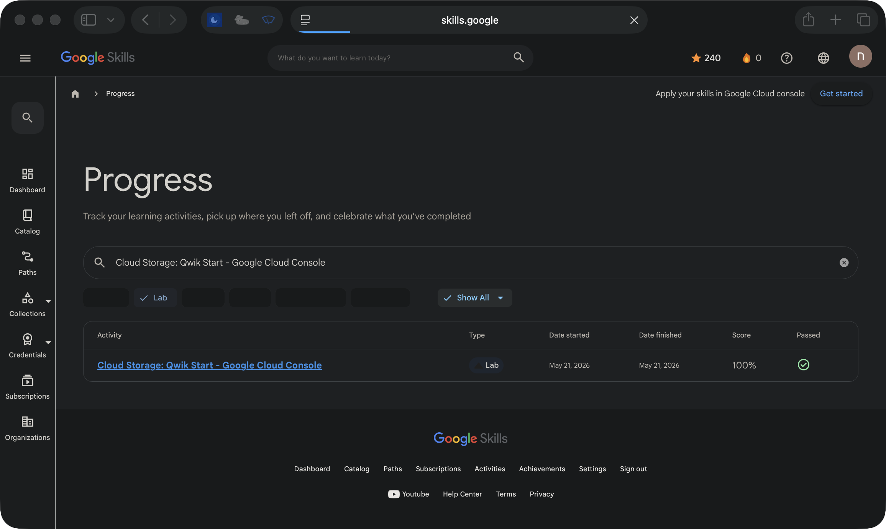

# Cloud Storage: Qwik Start - Google Cloud Console

**Track:** Storage  
**Google Skills status:** Passed  
**Recorded score:** 100%  
**Finished:** 2026-05-21

This page documents a **guided Google Skills lab**, not an independent production deployment. The completion status above is taken from my Google Skills activity history; the screenshot below shows the corresponding entry.

[View the original lab](https://www.skills.google/focuses/1760?parent=catalog) · [View the activity record (sign-in may be required)](https://www.skills.google/profile/activity?search_text=Cloud%20Storage%3A%20Qwik%20Start%20-%20Google%20Cloud%20Console&q%5Bactivity_type_in%5D%5B%5D=LabInstance)

## Architecture takeaway

Object storage is independent of VM lifecycle and is chosen by access pattern, retention, and durability needs.

## Evidence boundary

The screenshot verifies the activity record and its Passed marker. It does not prove a reproducible deployment, original application code, or a Google Skill Badge.

[Back to lab index](../LABS.md)

