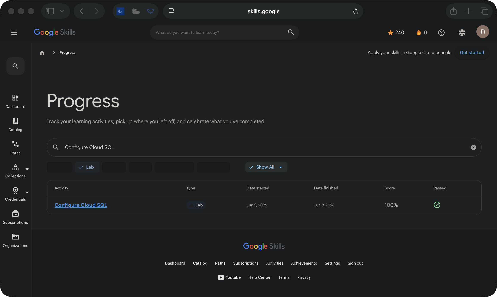

# Configure Cloud SQL

**Track:** Data  
**Google Skills status:** Passed  
**Recorded score:** 100%  
**Finished:** 2026-06-09

This page documents a **guided Google Skills lab**, not an independent production deployment. The completion status above is taken from my Google Skills activity history; the screenshot below shows the corresponding entry.

[View the original lab](https://www.skills.google/focuses/19086?parent=catalog) · [View the activity record (sign-in may be required)](https://www.skills.google/profile/activity?search_text=Configure%20Cloud%20SQL&q%5Bactivity_type_in%5D%5B%5D=LabInstance)

## Architecture takeaway

Cloud SQL provides managed relational databases, but capacity, availability, and connectivity still need design.

## Evidence boundary

The screenshot verifies the activity record and its Passed marker. It does not prove a reproducible deployment, original application code, or a Google Skill Badge.

[Back to lab index](../LABS.md)

