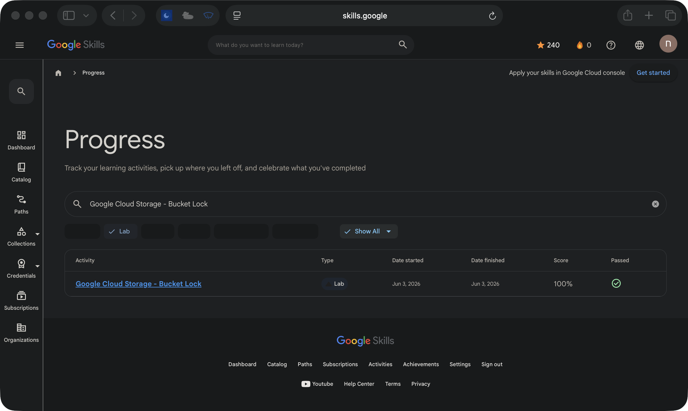

# Google Cloud Storage - Bucket Lock

**Track:** Storage & governance  
**Google Skills status:** Passed  
**Recorded score:** 100%  
**Finished:** 2026-06-03

This page documents a **guided Google Skills lab**, not an independent production deployment. The completion status above is taken from my Google Skills activity history; the screenshot below shows the corresponding entry.

[View the original lab](https://www.skills.google/focuses/3483?parent=catalog) · [View the activity record (sign-in may be required)](https://www.skills.google/profile/activity?search_text=Google%20Cloud%20Storage%20-%20Bucket%20Lock&q%5Bactivity_type_in%5D%5B%5D=LabInstance)

## Architecture takeaway

Bucket Lock supports retention enforcement; it is a governance control, not an access-control substitute.

## Evidence boundary

The screenshot verifies the activity record and its Passed marker. It does not prove a reproducible deployment, original application code, or a Google Skill Badge.

[Back to lab index](../LABS.md)

